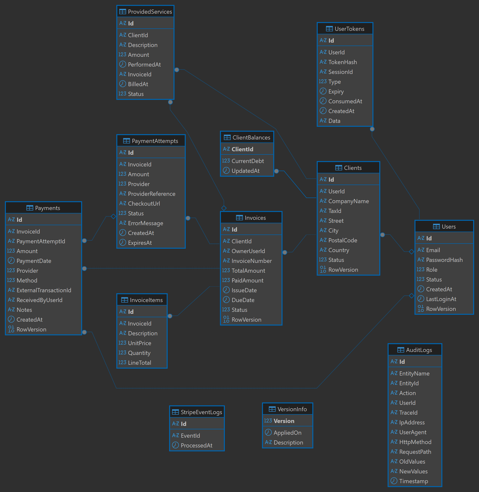

# ⚡ BillingFlow - Enterprise CRM & Billing Platform


> **BillingFlow** is a scalable, event-driven CRM and billing platform built to demonstrate enterprise-grade architecture in a modern .NET 8 ecosystem.  
> The solution combines **Domain-Driven Design (DDD)**, **Command Query Responsibility Segregation (CQRS)**, **Event-Driven Architecture (EDA)**, **Hangfire**, **SignalR**, and **Stripe** integration.

---

## 🏗️ Architecture & Core Principles

The solution is structured around **Clean Architecture** with **Vertical Slice** feature organization. Business logic stays in the domain and application layers, while infrastructure details remain isolated.

* **CQRS:** Write operations mutate rich domain aggregates through Entity Framework Core. Read operations use Dapper or raw SQL for fast, purpose-built queries.
* **DDD:** Aggregates such as `Invoice`, `Payment`, `Client`, `ProvidedService`, and `AppUser` protect invariants internally and emit domain events for downstream reactions.
* **Idempotency & Concurrency:** Stripe webhook delivery, payment attempts, and token handling are protected with unique constraints, row versions, and carefully designed state transitions.
* **Authorization:** JWT-based authentication is combined with permissions and policy-based checks. Customer-facing reads use row-level access rules inside handlers.
* **Auditing:** EF Core interceptors capture JSON deltas for entity changes and correlate them with distributed trace identifiers.
* **Real-time UX:** SignalR pushes payment updates to the frontend, backed by Redis for horizontal scaling.
* **Background Processing:** Hangfire handles recurring compliance and maintenance jobs without blocking request flow.

---

## 🗄️ Data Model & ERD

The system is centered around SQL Server tables mapped with EF Core and managed through FluentMigrator.



### Identity & Security
* **Users** - system identities, roles, password hashes, and lifecycle state.
* **UserTokens** - refresh tokens, password reset tokens, replay-detection support, and session tracking.

### CRM & Billing
* **Clients** - billing profiles, soft-delete lifecycle, and optional 1:1 linkage to `Users`.
* **ProvidedServices** - billable work recorded before invoicing.
* **Invoices** and **InvoiceItems** - the core financial aggregates that control billing state.

### Payments
* **PaymentAttempts** - reservation records for online payment sessions.
* **Payments** - immutable ledger entries for manual and online transactions.
* **StripeEventLogs** - webhook idempotency and deduplication records.

### Read Models & Infrastructure
* **ClientBalances** - materialized debt projection updated from payment events.
* **AuditLogs** - infrastructure-level audit trail with old/new values and request metadata.

---

## 🚀 Domain Modules Deep Dive

### 🛡️ Identity & Security
* Secure JWT issuance with refresh-token rotation.
* Replay-attack detection for reused refresh tokens.
* Hierarchical role management for admin and back-office users.

### 🏢 Client Management
* Clients move through an explicit lifecycle: `Active`, `Suspended`, and `Archived`.
* Archiving safely unlinks the underlying user account to avoid future uniqueness conflicts.
* Query filters keep archived clients out of normal reads.

### 📄 Billing & Invoicing
* Invoices begin as `Draft` and transition to `Unpaid` on issuance.
* Payments can move an invoice to `PartiallyPaid`, `Paid`, or `Overdue`.
* Invoice generation pulls unbilled services into an invoice and marks them billed.
* PDF generation is handled asynchronously through QuestPDF.

### 💳 Payment Processing
* Online payments use a reservation-based workflow through `PaymentAttempt`.
* Stripe webhook processing is protected by cryptographic signature validation.
* Successful payments emit a `PaymentRecordedEvent`, which updates the `ClientBalances` read model using raw SQL UPSERT logic.

### ⚙️ Background Jobs & Real-Time
* `CleanupExpiredTokensJob` removes expired tokens.
* `CheckOverdueInvoicesJob` marks overdue invoices.
* `SuspendOverdueClientsJob` enforces compliance rules.
* SignalR publishes payment updates to connected users in real time.

---

## 🛠️ Technology Stack

| Category | Technology |
| :--- | :--- |
| Platform | .NET 8, C# 12, ASP.NET Core Web API |
| Write Model | Entity Framework Core 8 |
| Read Model | Dapper, raw SQL, stored procedures |
| Database | Microsoft SQL Server 2022 |
| Migrations | FluentMigrator |
| Messaging | MediatR |
| Background Jobs | Hangfire |
| Real-Time | SignalR + StackExchange.Redis |
| External APIs | Stripe.net |
| PDF Generation | QuestPDF |
| Validation | FluentValidation |
| Security | JWT Bearer, BCrypt.Net |
| Testing | xUnit, Moq, FluentAssertions, MockQueryable |
| Integration Testing | Testcontainers, Respawn |

---

## 🚦 Getting Started

The environment is containerized. A single command provisions SQL Server, Redis, applies migrations, and starts the API.

### 1. Environment Setup
Copy the template configuration file and fill in the required secrets.

```bash
cp .env.example .env
```

Make sure `STRIPE_SECRET_KEY` and the other required variables are set correctly.

### 2. Start the Stack

```bash
docker compose up --build
```

The stack starts the database, Redis, migrator, API, and Stripe CLI tunnel. Wait for the migrator to finish before running flows that depend on the schema.

### 3. Stripe Webhook Configuration
The local Stripe CLI container prints a webhook signing secret (`whsec_...`).

Add that value to `.env` under `STRIPE_WEBHOOK_SECRET`, then restart the API container so the new secret is loaded.

### 4. Swagger / API Docs
When the API is running, open the interactive OpenAPI UI:

```text
http://localhost:8080/swagger/index.html
```

Paste a raw JWT into Swagger's **Authorize** dialog. The UI injects the `Bearer ` prefix automatically.

### 5. Postman
Import the provided [Postman collection](./docs/BillingFlow.postman_collection.json) to exercise end-to-end flows.

The collection is prepared for:
* login and token capture,
* refresh-token rotation,
* authorized API requests,
* invoice/payment workflows.

---

## 🧪 Testing Strategy

* **Domain tests** validate aggregate invariants in isolation.
* **Application tests** verify handlers, policies, and command/query behavior with mocks.
* **Integration tests** use Testcontainers to run against a real SQL Server instance.
* **Respawn** resets database state between tests for deterministic execution.
* **Concurrency tests** exercise raw SQL UPSERT logic and webhook idempotency under parallel execution.

---

## 🔮 Future Roadmap

* Localization and currency formatting for PDFs and UI.
* Transactional Outbox for delayed side effects.
* Expanded global rate limiting using Redis.
* Back-office SPA and customer portal.
* Production email provider integration.
* Additional payment providers alongside Stripe.

---

## 📜 License

This project is licensed under the MIT License. See the `LICENSE` file for details.
